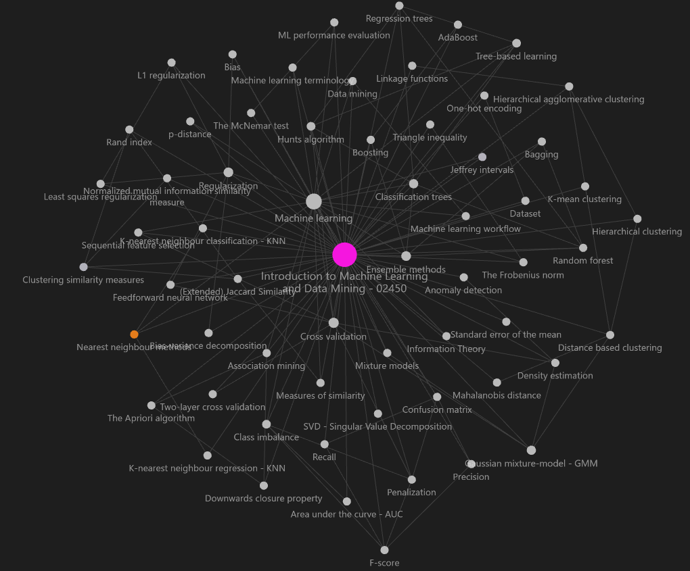

Modified: `$= dv.current().file.mtime`
Tags: [#Utility]
****
# Introduction to Machine Learning and Data Mining - 02450

This [Obsidian vault](https://obsidian.md/) contains my notes taken during the fall semester 2022.

The purpose of this vault is to supply an easy to navigate lexicon for the various theorems and methods taught in the course. Note that not all notes are complete nor perfectly written, and thus another purpose of this vault is to create a basis for your own note system for this course, hopefully helping you to not have to create everything from scratch.

## Installation
1. Install [Obsidian](https://obsidian.md/)
2. `git clone `
3. Open vault using obsidian
4. Keep safe mode off (To allow the community plugins)

## Get newest updates
Simply `git pull` in the vault folder.